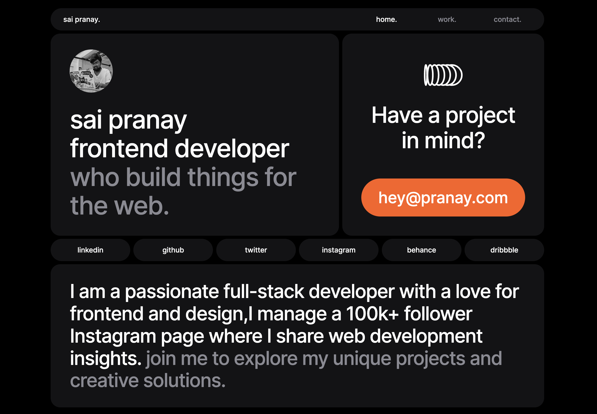

## Bento Grid Portfolio Landing Page

This is a Bento Grid Portfolio Landing Page built using React and Tailwind CSS. It's a simple and elegant way to showcase your work, with a clean and responsive design that looks great on any device.
____

____
### Features

* Bento Grid layout for easy project management
* Tailwind CSS library for easy customization
* Responsive design looks great on any device
* Clean and elegant style

### Requirements

* React
* Tailwind CSS

### Setup

1. Clone the repository
2. Install the dependencies
3. Start the development server
4. Open `http://localhost:5173` in your browser

### Customization

You can also add your own custom CSS to the `src/index.css` file.

### Deployment

To deploy the portfolio, you can use a variety of different methods. One popular option is to use Netlify.

To deploy to Netlify, simply create a new Netlify site and connect it to your GitHub repository. Netlify will automatically build and deploy your portfolio whenever you push changes to your repository.

### Conclusion

I hope you enjoy using this Bento Grid Portfolio Landing Page! If you have any questions or feedback, please feel free to create an issue on the GitHub repository.

**Link:** https://bento-grid-portfolio.vercel.app/
